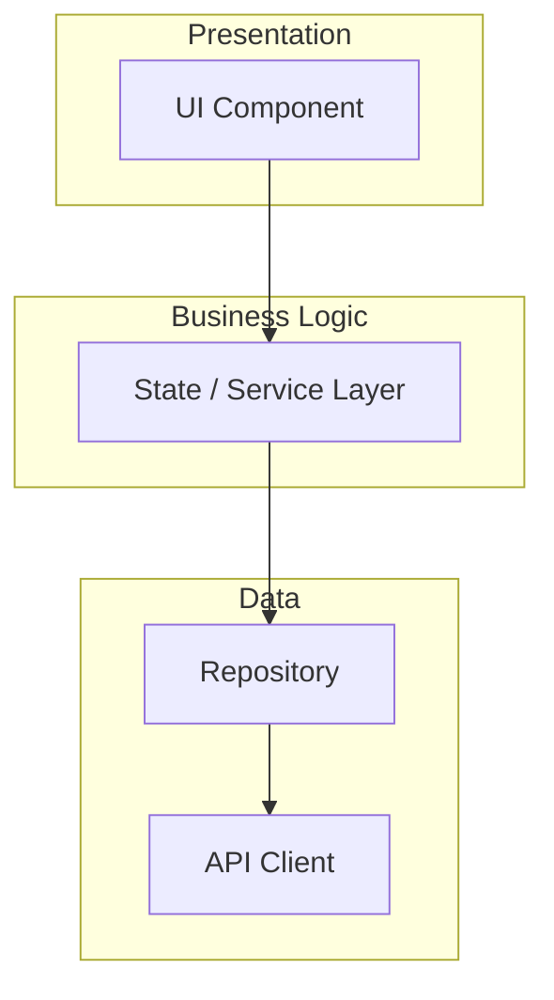

# Technical Spec: {JIRA_ID}

## Overview

{Brief description of the feature/work item and its business value. 2-3 sentences.}

## Jira Reference

- **Ticket:** [{JIRA_ID}]({jira_url})
- **Type:** {Epic/Story/Task/Bug}
- **Summary:** {ticket summary}

## Context

{Why this work is needed. Include:

- Business value and user impact
- Current state vs desired state
- Any relevant background information}

## Requirements

### Functional Requirements

- **FR1:** {Requirement description}
- **FR2:** {Requirement description}
- **FR3:** {Requirement description}

### Non-Functional Requirements

- **NFR1:** Performance — {targets, e.g., "API response < 200ms"}
- **NFR2:** Accessibility — {WCAG level, screen reader support}
- **NFR3:** {Other requirements: security, reliability, etc.}

## Architecture

### Architecture Impact

{List the architectural layers/components affected, based on the project's own architecture:}

- [ ] **{Layer 1}** — {description from project context}
- [ ] **{Layer 2}** — {description from project context}
- [ ] **{Layer 3}** — {description from project context}
- [ ] **{Layer 4}** — {description from project context}

### Project Structure

{Adapt to the project's conventions:}

```text
{project structure based on the feature/module organization pattern from project context}
```

### Component Diagram

{Use Mermaid syntax for all diagrams. Include:

- Data flow between layers
- Key classes/modules and their responsibilities
- External service integrations}



### State Management

- **Approach:** {state-management or application-state solution per project conventions}
- **States/State shape:** {define states based on the project's own patterns}
- **Actions/Events:** (if applicable) {define based on the project's own patterns}

### Data Models

{List new or modified models:}

```text
// Example model structure
{ModelName}
  id: string
  name: string
  // ... other fields
```

- **Code generation:** {codegen/serialization tooling the project uses, if any}
- **Serialization:** {JSON structure if API-related}

### API Changes

{If applicable:}

| Endpoint | Method | Description |
|----------|--------|-------------|
| `/api/v1/{resource}` | GET | {Description} |
| `/api/v1/{resource}` | POST | {Description} |

**Request/Response Examples:**

```json
{
  "field": "value"
}
```

```json
{
  "id": "123",
  "field": "value"
}
```

## Dependencies

### Internal Dependencies

- `{package_name}` — {why needed}
- `{feature_name}` — {interaction description}

### External Dependencies

| Package | Version | Justification |
|---------|---------|---------------|
| `{package}` | `^x.y.z` | {Why this package is needed} |

## Testing Strategy

**Target:** {per project testing guidelines}

### Unit Tests

{Based on the project's own testing patterns:}

- [ ] **Business Logic Tests** — {state management, services, etc.}
- [ ] **Data Layer Tests** — {repositories, API clients, etc.}
- [ ] **Model Tests** — {serialization, equality, validation}

### Component/UI Tests

{Based on the project's own testing patterns:}

- [ ] **Component Tests** — {individual component behavior}
- [ ] **Screen/Page Tests** — {rendering, user interactions}

### Integration Tests

{Based on the project's own testing patterns:}

- [ ] **End-to-End Flows** — {list critical user journeys to test}

### Test Utilities Needed

- Mock implementations for: {list services to mock}
- Test fixtures for: {list data fixtures needed}

## Accessibility Checklist

- [ ] Semantic labels/roles for all interactive elements
- [ ] Color contrast ratio >= 4.5:1 for text
- [ ] Touch/click targets meet the platform's minimum size
- [ ] Screen reader support with meaningful descriptions
- [ ] Dynamic text scaling / zoom support
- [ ] Focus management for navigation
- [ ] Error states announced to assistive technology

## Acceptance Criteria

{From the Jira ticket, refined with clarifications:}

1. **Given** {precondition}, **When** {action}, **Then** {expected result}
2. **Given** {precondition}, **When** {action}, **Then** {expected result}
3. {Additional criteria...}

## Open Questions

{Items needing team discussion before implementation:}

1. {Question about architecture/approach}
2. {Question about edge cases}
3. {Question about dependencies}

## Out of Scope

{Explicitly list what this spec does NOT cover:}

- {Item 1}
- {Item 2}

## References

- **Jira:** [{JIRA_ID}]({jira_url})
- **Design:** {Figma link if available}
- **API Docs:** {API documentation link if available}
- **Related Tickets:** {List related Jira tickets}
